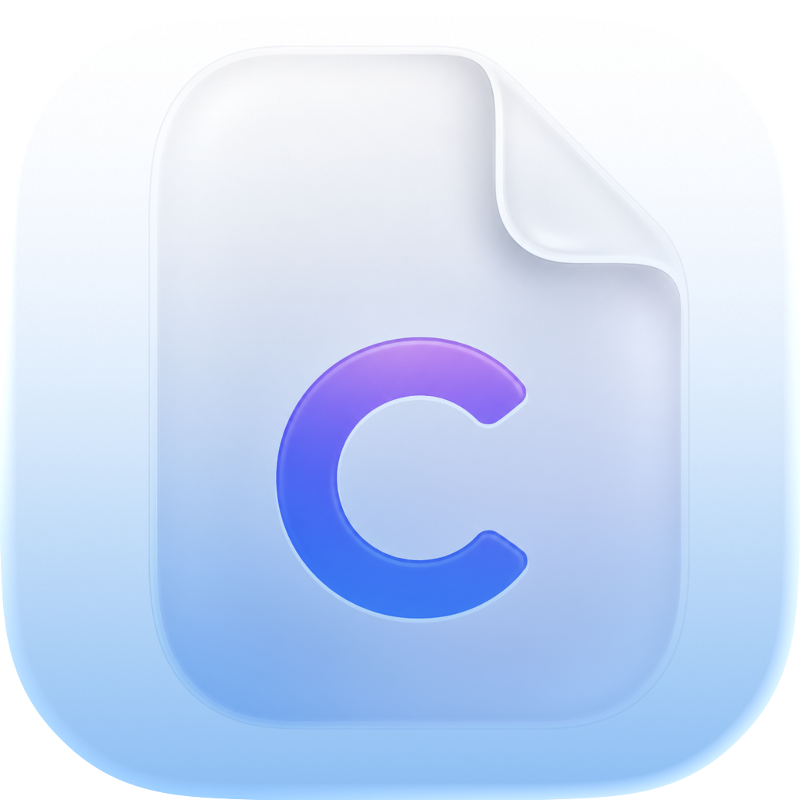

# CorePDF

<p align="center">
  
</p>

A native macOS PDF editor built with SwiftUI, PDFKit, and the Swift Observation framework. Designed to feel at home on macOS 26 with a "Liquid Glass" toolbar aesthetic.

## Features

### Document Management
- Open multiple PDFs simultaneously in a **Safari-style tab bar**
- Drag-and-drop or use ⌘O to open files
- Unsaved-changes alert on tab close (Save / Don't Save / Cancel)
- **Background saving** — large files are written on a background thread so the app stays responsive; a spinner appears in the tab while saving

### PDF Viewer
- Continuous scroll and single-page display modes
- Pinch-to-zoom and keyboard zoom (⌘= / ⌘− / ⌘0)
- Zoom percentage display synced live with trackpad pinch
- **Reading modes**: Default, Night (inverted), Sepia
- Text-to-speech for the current page

### Annotation Tools
- **Highlight**, **Underline**, **Strikethrough** — applied on mouse-up after text selection (no duplicate annotations)
- **Freehand ink** drawing
- **Text box** (comment) annotations via click + prompt
- Floating annotation palette for per-tool color and opacity
- All annotation colors and opacity are configurable in **Settings → Annotations**

### Page Organizer
- Grid view for all pages (⌘2)
- Drag-to-reorder pages using the native Transferable API
- Rotate left/right, delete, copy selection to clipboard
- Multi-select with ⌘-click or Select All (⌘A)
- Context menus on each page thumbnail

### Sidebar
- **Thumbnails** — scrollable page list with tap-to-navigate
- **Outline** — table of contents tree (when present in the PDF)
- **Bookmarks** — bookmark individual pages with one click
- **Annotations list** — all annotations across the document
- Toggle with ⌘⇧S

### Settings (⌘,)
| Pane | Options |
|------|---------|
| **General** | Appearance (System / Light / Dark), default reading mode, sidebar visibility, restore documents on launch |
| **Display** | Default zoom level, default view mode (Scroll / Grid) |
| **Annotations** | Default highlight/underline/strikethrough/freehand colors and opacity |
| **Tools** | Choose which annotation tools appear in the toolbar |

All settings are persisted to UserDefaults and applied immediately — including live appearance switching.

### Keyboard Shortcuts
| Action | Shortcut |
|--------|----------|
| Open PDF | ⌘O |
| Save | ⌘S |
| Close Tab | ⌘W |
| Toggle Sidebar | ⌘⇧S |
| Zoom In / Out / Actual | ⌘= / ⌘− / ⌘0 |
| Switch to tab N | ⌘1 – ⌘9 |
| Select tool | E |
| Highlight | H |
| Underline | U |
| Strikethrough | K |
| Freehand | F |
| Text Box | T |
| Settings | ⌘, |

## Requirements

- **macOS 26** (Sequoia) or later
- **Xcode 26.4** or later
- Swift 5.10+

## Architecture

```
CorePDF/
├── CorePDFApp.swift          # @main — WindowGroup + Settings scene, commands
├── ContentView.swift         # Root layout, toolbar, file importer
├── Models/
│   ├── AppState.swift        # @Observable singleton — tabs, active tool, UI flags
│   ├── DocumentTab.swift     # Per-document state (page index, bookmarks, modified)
│   ├── ActiveTool.swift      # Annotation tool enum
│   ├── ReadingMode.swift     # Default / Night / Sepia
│   └── ViewMode.swift        # Scroll / Grid
├── Modules/
│   ├── PDFViewerCore/        # NSViewRepresentable PDFView bridge + zoom/TTS VM
│   ├── AnnotationManager/    # Annotation VM + floating palette view
│   ├── PageOrganizer/        # Grid page reorder view + VM
│   ├── ContentEditor/        # (in progress)
│   ├── DocumentIntelligence/ # (in progress)
│   └── FormsAndSignatures/   # Signature canvas + form handler
├── Views/
│   ├── Sidebar/              # ThumbnailSidebarView, SidebarView, sub-views
│   ├── Toolbar/              # Toolbar component views
│   └── Welcome/              # Empty-state welcome screen
└── Settings/
    ├── SettingsStore.swift   # @Observable UserDefaults-backed preferences
    ├── SettingsView.swift    # NavigationSplitView shell
    └── Panes/                # GeneralSettingsPane, DisplaySettingsPane, etc.
```

**Patterns used:**
- `@Observable` + `@MainActor` throughout (Swift Observation framework, no `ObservableObject`)
- `NSViewRepresentable` bridge to `PDFKit.PDFView`
- `Transferable` + `.draggable` / `.dropDestination` for page reorder
- Security-scoped resource bookmarks kept open for the lifetime of each tab
- Background saves via `Task.detached(priority: .userInitiated)`

## Getting Started

1. Clone the repo
2. Open `CorePDF.xcodeproj` in Xcode 26.4+
3. Select your development team in **Signing & Capabilities**
4. Run on macOS 26 (⌘R)

## License

MIT License — see [LICENSE](LICENSE) for details.
