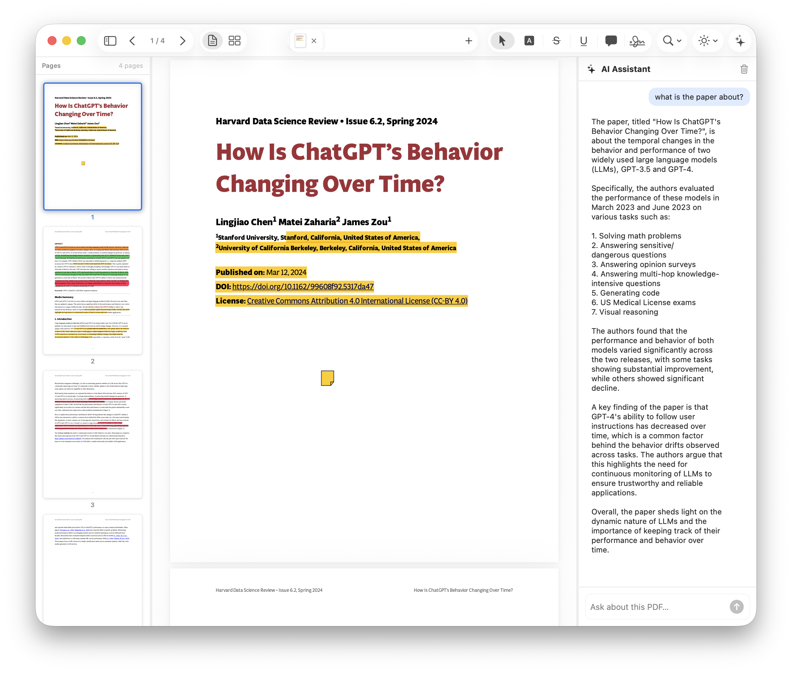
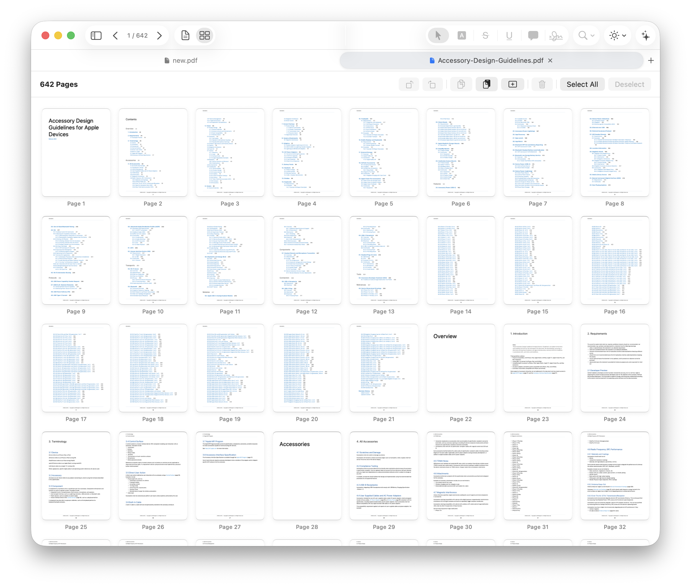
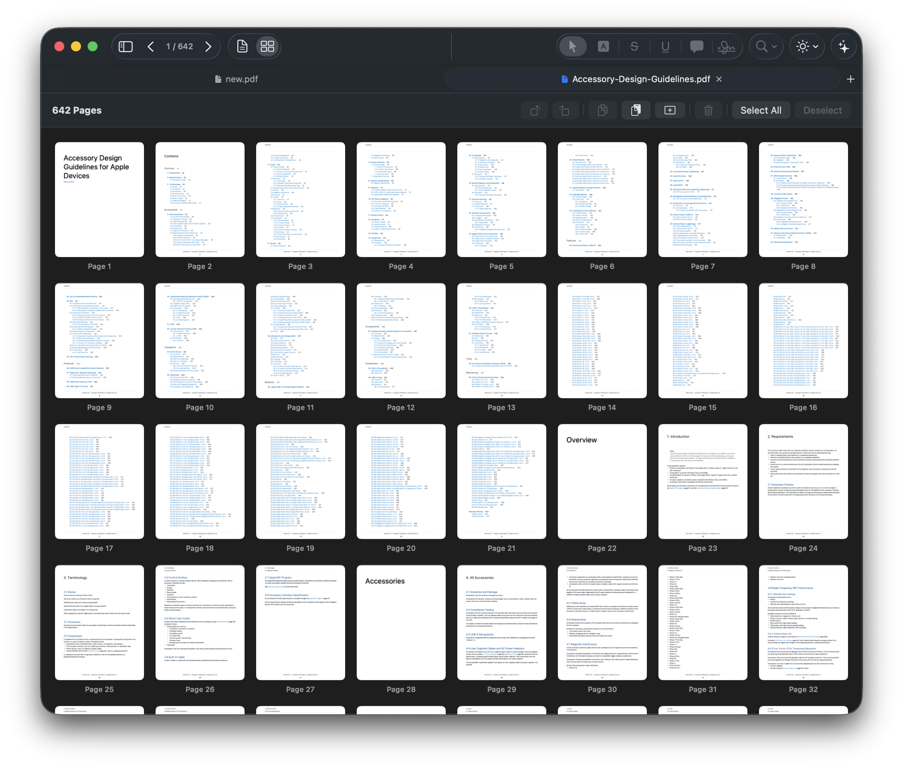

# CorePDF

<p align="center">
  
</p>

<p align="center">
  A native macOS PDF editor built with SwiftUI, PDFKit, and the Swift Observation framework.<br>
  Designed to feel at home on macOS 26 with a Liquid Glass toolbar aesthetic.
</p>

---

## Screenshots

<p align="center">
  
  <br><em>Scroll view with thumbnail sidebar, annotation tools, and resizable AI sidebar</em>
</p>

<p align="center">
  
  <br><em>Page organizer grid in light mode</em>
</p>

<p align="center">
  
  <br><em>Page organizer grid in dark mode — 642-page document</em>
</p>

---

## Features

### Document Management
- Open multiple PDFs in a **Safari-style tab bar** (embedded in toolbar or as a dedicated strip)
- Open via ⌘O, drag-and-drop, or **New Empty Document** (⌘N)
- Per-tab unsaved-changes indicator (blue dot) and Save / Don't Save / Cancel alert on close
- **Non-blocking background save** — PDF serialisation and disk write both run off the main thread; ⌘S returns instantly

### PDF Viewer
- **Scroll view** (continuous) and **Page Grid** organizer (⌘⇧1 / ⌘⇧2)
- Pinch-to-zoom and keyboard zoom (⌘= / ⌘−) with live percentage readout
- **Reading modes** — Default · Night · Sepia (toolbar dropdown)
- Text selection with instant annotation application

### Annotation Tools
| Tool | Shortcut | Description |
|------|----------|-------------|
| Select | E | Move/resize existing annotations |
| Highlight | H | Colour highlight over selected text |
| Underline | U | Underline selected text |
| Strikethrough | K | Strikethrough selected text |
| Text / Comment | C | Click to place a text-box annotation |
| Signature | G | Draw a freehand signature; resizable via PDFKit handles |

- Per-tool colours and opacity configurable in **Settings → Annotations**
- Choose which tools appear in the toolbar in **Settings → Tools**

### Page Organizer (Grid View)
- Full-document grid with page thumbnails and page numbers
- Drag-to-reorder via native Transferable API
- Rotate left / right, delete, copy pages (⌘C), paste pages (⌘V), add empty page
- Multi-select with ⌘-click · Select All (⌘A) · Deselect

### Thumbnail Sidebar
- **Preview.app-style** single-column layout — thumbnail image on top, page number centred below
- Thumbnails fill the available width and render at @2x for Retina
- **Draggable resize handle** — drag the divider to make the sidebar wider or narrower (120–244 pt)
- Sections: Thumbnails · Outline · Bookmarks · Annotations list
- Toggle with ⌘⇧S

### AI Assistant Sidebar
- **Sparkles (✦) toolbar button** — toggles a resizable right sidebar
- Ask any question about the open document; the PDF's text is automatically included as context (capped at 12 000 chars)
- Supports **OpenAI**, **Claude (Anthropic)**, and **Groq** (llama-3.3-70b, llama-3.1-8b, gemma2-9b, mixtral-8x7b)
- Chat history with user/assistant bubbles, animated typing indicator, and one-tap clear
- Configure provider, model, and API keys in **Settings → AI**
- API keys stored exclusively in the **macOS Keychain** — never in UserDefaults or logs

### Settings (⌘,)
| Pane | Options |
|------|---------|
| **General** | Appearance (System / Light / Dark), default reading mode, sidebar visibility on launch, restore documents on launch, tab bar style (In Toolbar / Tab Bar) |
| **Display** | Default zoom level, default view mode |
| **Annotations** | Highlight · underline · strikethrough colours and opacity |
| **Tools** | Choose which annotation tools are visible in the toolbar (with keyboard shortcut badges) |
| **AI** | Provider picker, model picker, API key management (OpenAI · Claude · Groq) |

### Toolbar
- **Left**: sidebar toggle, page navigation (◀ N/total ▶), scroll/grid picker
- **Centre**: tab strip (In Toolbar mode)
- **Right**: annotation tool picker → zoom menu → reading mode menu → AI sparkles button
- All right-side items collapse gracefully into a `>>` overflow menu with proper submenus

### Keyboard Shortcuts
| Action | Shortcut |
|--------|----------|
| Open PDF | ⌘O |
| New Empty Document | ⌘N |
| New Tab | ⌘T |
| Save | ⌘S |
| Close Tab | ⌘W |
| Toggle Sidebar | ⌘⇧S |
| Scroll View | ⌘⇧1 |
| Page Grid | ⌘⇧2 |
| Zoom In / Out / Actual | ⌘= / ⌘− / ⌘0 |
| Select tool | E |
| Highlight | H |
| Underline | U |
| Strikethrough | K |
| Text / Comment | C |
| Signature | G |
| Settings | ⌘, |

---

## Requirements

- **macOS 26** or later
- **Xcode 26.4** or later

---

## Architecture

```
CorePDF/
├── CorePDFApp.swift              # @main — WindowGroup, Settings scene, menu commands
├── ContentView.swift             # Root layout, resizable sidebars, toolbar, file importer
├── CorePDF.entitlements          # App Sandbox + network.client + user-selected files
├── Models/
│   ├── AppState.swift            # @Observable singleton — tabs, active tool, sidebar flags
│   ├── DocumentTab.swift         # Per-document state; non-blocking background save
│   ├── ActiveTool.swift          # Annotation tool enum with keyboard shortcut metadata
│   ├── AIProvider.swift          # AI provider enum + Keychain API key store
│   ├── ReadingMode.swift         # Default / Night / Sepia
│   └── ViewMode.swift            # Scroll / Grid
├── Services/
│   └── AIService.swift           # @Observable — OpenAI / Anthropic / Groq HTTPS calls
├── Modules/
│   ├── PDFViewerCore/            # NSViewRepresentable PDFView bridge, zoom VM, cursor monitors
│   ├── AnnotationManager/        # Annotation VM + floating colour/opacity palette
│   ├── PageOrganizer/            # Grid reorder view + VM (copy/paste/add-empty/rotate/delete)
│   └── FormsAndSignatures/       # Signature canvas + PDFKit freeText annotation commit
├── Views/
│   ├── Sidebar/                  # ThumbnailSidebarView, ThumbnailCardView, OutlineView, etc.
│   ├── AISidebar/                # AIChatSidebarView, chat bubbles, typing indicator
│   ├── Toolbar/                  # Tab bar row, tab item views
│   └── Welcome/                  # Empty-state welcome screen
└── Settings/
    ├── SettingsStore.swift        # @Observable UserDefaults-backed preferences
    ├── SettingsView.swift         # TabView shell with icon strip
    └── Panes/                     # General · Display · Annotations · Tools · AI
```

**Key patterns:**
- `@Observable` + `@MainActor` throughout — no `ObservableObject` or `Combine`
- `NSViewRepresentable` bridge to `PDFKit.PDFView` with `NSEvent` global monitors for annotation clicks
- `Transferable` + `.draggable` / `.dropDestination` for page reorder
- Security-scoped resource bookmarks held open for the lifetime of each tab
- `Task.detached(priority: .userInitiated)` for non-blocking PDF serialisation and disk write
- API keys in `kSecClassGenericPassword` Keychain items, `kSecAttrAccessibleWhenUnlockedThisDeviceOnly`

---

## Getting Started

1. Clone the repo
2. Open `CorePDF.xcodeproj` in Xcode 26.4+
3. Select your development team in **Signing & Capabilities**
4. Run on macOS 26 (⌘R)

---

## License

MIT License — see [LICENSE](LICENSE) for details.
